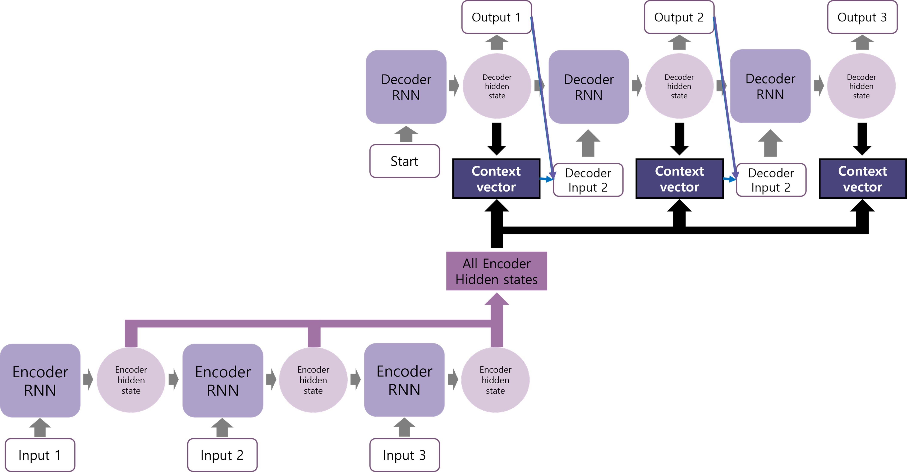

# Neural Machine Translation by Jointly Learning to Align and Translate
https://arxiv.org/abs/1409.0473

## 구조


## 구현
- Seq2Seq using Bahdanau Attention
  - [PyTorch](Seq2Seq+Bahdanau_Attention.py)

### 결과
```
Seq2Seq(
  (encoder): Encoder(
    (embedding): Embedding(24745, 512)
    (bi_rnn): RNN(512, 128, bidirectional=True)
    (dropout): Dropout(p=0, inplace=False)
  )
  (decoder): Decoder(
    (embedding): Embedding(8854, 256)
    (rnn): RNN(256, 64)
    (fc): Linear(in_features=64, out_features=8854, bias=True)
    (dropout): Dropout(p=0, inplace=False)
  )
  (attention): BahdanauAttention(
    (Wb): Linear(in_features=64, out_features=64, bias=False)
    (Wc): Linear(in_features=256, out_features=64, bias=False)
    (Wa_T): Linear(in_features=64, out_features=1, bias=False)
  )
  (fc): Linear(in_features=256, out_features=64, bias=True)
)
```
```
The model has 15,733,526 trainable parameters.
```
## 참고 자료
1. https://wikidocs.net/73161
1. https://wikidocs.net/166653
1. https://heung-bae-lee.github.io/2020/01/21/deep_learning_10/
