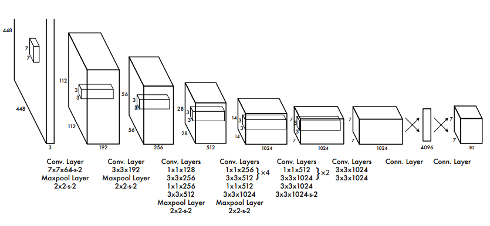
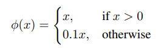
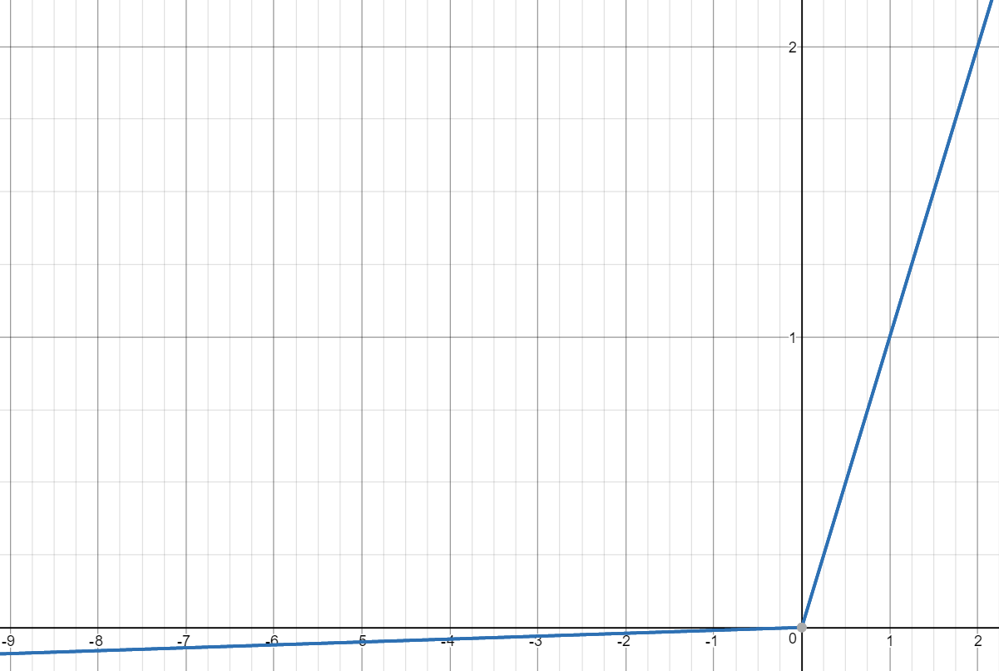
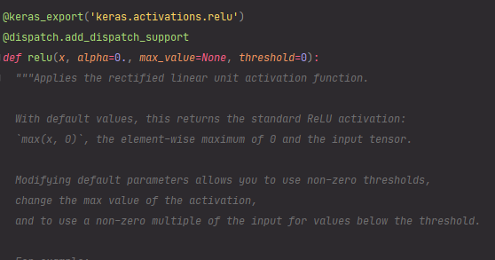

# You Only Look Once: Unified, Real-Time Object Detection

https://arxiv.org/abs/1506.02640

## YOLOv1 모델 구조



## Leaky Relu의 수식과 그래프

Leaky Relu란 Relu 함수에서 x가 음수 영역에서 그래디언트가 0.01씩 증가하도록 약간의 변형을 가한 함수입니다. 음수 영역에서 그래디언트가 무조건 0이 된다는 단점을 극복하기 위해 고안되었습니다.





YOLOv1는 컨볼루션 레이어의 활성화 함수로 Leaky Relu 함수를 채택하고 있습니다.

## Keras를 이용한 YOLOv1 모델 구현

### Keras에서 Leaky Relu

아래의 그림은 Keras의 Relu 코드 내부를 캡처한 것입니다. Leaky Relu를 사용하고 싶다면 파라미터로 alpha 값은 0.1을 주면 Leaky Relu가 됩니다.



### 결과

```
Model: "sequential"
_________________________________________________________________
Layer (type)                 Output Shape              Param #
=================================================================
conv2d (Conv2D)              (None, 224, 224, 64)      9472
_________________________________________________________________
leaky_re_lu (LeakyReLU)      (None, 224, 224, 64)      0
_________________________________________________________________
max_pooling2d (MaxPooling2D) (None, 112, 112, 64)      0
_________________________________________________________________
conv2d_1 (Conv2D)            (None, 112, 112, 192)     110784
_________________________________________________________________
leaky_re_lu_1 (LeakyReLU)    (None, 112, 112, 192)     0
_________________________________________________________________
max_pooling2d_1 (MaxPooling2 (None, 56, 56, 192)       0
_________________________________________________________________
conv2d_2 (Conv2D)            (None, 56, 56, 128)       24704
_________________________________________________________________
leaky_re_lu_2 (LeakyReLU)    (None, 56, 56, 128)       0
_________________________________________________________________
conv2d_3 (Conv2D)            (None, 56, 56, 256)       295168
_________________________________________________________________
leaky_re_lu_3 (LeakyReLU)    (None, 56, 56, 256)       0
_________________________________________________________________
conv2d_4 (Conv2D)            (None, 56, 56, 256)       65792
_________________________________________________________________
leaky_re_lu_4 (LeakyReLU)    (None, 56, 56, 256)       0
_________________________________________________________________
conv2d_5 (Conv2D)            (None, 56, 56, 512)       1180160
_________________________________________________________________
leaky_re_lu_5 (LeakyReLU)    (None, 56, 56, 512)       0
_________________________________________________________________
max_pooling2d_2 (MaxPooling2 (None, 28, 28, 512)       0
_________________________________________________________________
conv2d_6 (Conv2D)            (None, 28, 28, 256)       131328
_________________________________________________________________
leaky_re_lu_6 (LeakyReLU)    (None, 28, 28, 256)       0
_________________________________________________________________
conv2d_7 (Conv2D)            (None, 28, 28, 512)       1180160
_________________________________________________________________
leaky_re_lu_7 (LeakyReLU)    (None, 28, 28, 512)       0
_________________________________________________________________
conv2d_8 (Conv2D)            (None, 28, 28, 256)       131328
_________________________________________________________________
leaky_re_lu_8 (LeakyReLU)    (None, 28, 28, 256)       0
_________________________________________________________________
conv2d_9 (Conv2D)            (None, 28, 28, 512)       1180160
_________________________________________________________________
leaky_re_lu_9 (LeakyReLU)    (None, 28, 28, 512)       0
_________________________________________________________________
conv2d_10 (Conv2D)           (None, 28, 28, 256)       131328
_________________________________________________________________
leaky_re_lu_10 (LeakyReLU)   (None, 28, 28, 256)       0
_________________________________________________________________
conv2d_11 (Conv2D)           (None, 28, 28, 512)       1180160
_________________________________________________________________
leaky_re_lu_11 (LeakyReLU)   (None, 28, 28, 512)       0
_________________________________________________________________
conv2d_12 (Conv2D)           (None, 28, 28, 256)       131328
_________________________________________________________________
leaky_re_lu_12 (LeakyReLU)   (None, 28, 28, 256)       0
_________________________________________________________________
conv2d_13 (Conv2D)           (None, 28, 28, 512)       1180160
_________________________________________________________________
leaky_re_lu_13 (LeakyReLU)   (None, 28, 28, 512)       0
_________________________________________________________________
conv2d_14 (Conv2D)           (None, 28, 28, 512)       262656
_________________________________________________________________
leaky_re_lu_14 (LeakyReLU)   (None, 28, 28, 512)       0
_________________________________________________________________
conv2d_15 (Conv2D)           (None, 28, 28, 1024)      4719616
_________________________________________________________________
leaky_re_lu_15 (LeakyReLU)   (None, 28, 28, 1024)      0
_________________________________________________________________
max_pooling2d_3 (MaxPooling2 (None, 14, 14, 1024)      0
_________________________________________________________________
conv2d_16 (Conv2D)           (None, 14, 14, 512)       524800
_________________________________________________________________
leaky_re_lu_16 (LeakyReLU)   (None, 14, 14, 512)       0
_________________________________________________________________
conv2d_17 (Conv2D)           (None, 14, 14, 1024)      4719616
_________________________________________________________________
leaky_re_lu_17 (LeakyReLU)   (None, 14, 14, 1024)      0
_________________________________________________________________
conv2d_18 (Conv2D)           (None, 14, 14, 512)       524800
_________________________________________________________________
leaky_re_lu_18 (LeakyReLU)   (None, 14, 14, 512)       0
_________________________________________________________________
conv2d_19 (Conv2D)           (None, 14, 14, 1024)      4719616
_________________________________________________________________
leaky_re_lu_19 (LeakyReLU)   (None, 14, 14, 1024)      0
_________________________________________________________________
conv2d_20 (Conv2D)           (None, 14, 14, 1024)      9438208
_________________________________________________________________
leaky_re_lu_20 (LeakyReLU)   (None, 14, 14, 1024)      0
_________________________________________________________________
conv2d_21 (Conv2D)           (None, 7, 7, 1024)        9438208
_________________________________________________________________
leaky_re_lu_21 (LeakyReLU)   (None, 7, 7, 1024)        0
_________________________________________________________________
conv2d_22 (Conv2D)           (None, 7, 7, 1024)        9438208
_________________________________________________________________
leaky_re_lu_22 (LeakyReLU)   (None, 7, 7, 1024)        0
_________________________________________________________________
conv2d_23 (Conv2D)           (None, 7, 7, 1024)        9438208
_________________________________________________________________
leaky_re_lu_23 (LeakyReLU)   (None, 7, 7, 1024)        0
_________________________________________________________________
flatten (Flatten)            (None, 50176)             0
_________________________________________________________________
dense (Dense)                (None, 4096)              205524992
_________________________________________________________________
dropout (Dropout)            (None, 4096)              0
_________________________________________________________________
dense_1 (Dense)              (None, 1470)              6022590
_________________________________________________________________
reshape (Reshape)            (None, 7, 7, 30)          0
=================================================================
Total params: 271,703,550
Trainable params: 271,703,550
Non-trainable params: 0
_________________________________________________________________
None
```
